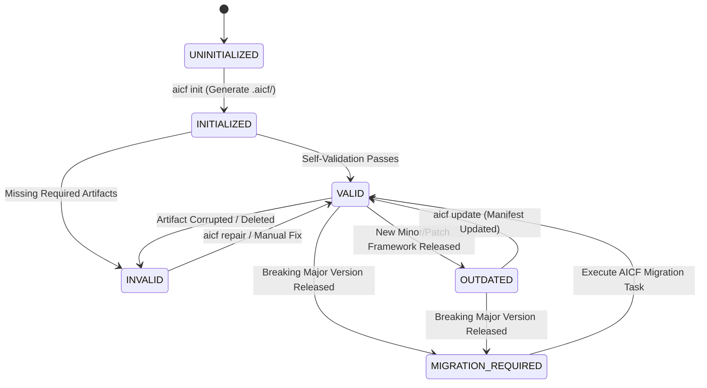

# AICF Bootstrap & Discovery Specification

**Document ID:** AICF-001  
**Category:** Normative Specification  
**Status:** Draft (v0.1)  
**Target Release:** AICF v0.1  

---

## 1. Purpose

This specification defines the normative requirements, protocols, heuristics, and boundaries for **discovering, initializing, profiling, validating, and activating AICF (AI Companion Framework)** within a software codebase.

It serves as the authoritative blueprint for:
1. **Developer Tooling & CLI (`aicf`):** Implementing commands such as `aicf init`, `aicf detect`, `aicf validate`, and `aicf doctor`.
2. **Editor & Agent Adapters:** Discovering `.aicf/`, verifying framework health, loading minimal viable context, and managing lifecycle events across disparate AI coding environments (e.g., Cursor, Anthropic Claude, Google Gemini, Google Antigravity).
3. **Template Authors:** Structuring canonical and profile-specific starter templates that can be deterministically seeded into new or existing projects.

---

## 2. Scope

### In Scope
- **Discovery Protocol:** Normative algorithms for locating `.aicf/` across single-project repositories, nested directories, and monorepos.
- **Repository Detection:** Heuristics for classifying repository modes (greenfield vs. brownfield), language stacks, build systems, test runners, and existing AI configurations without executing untrusted code.
- **Initialization Workflow:** Step-by-step normative behavior for `aicf init`, including preconditions, user confirmation, dry-run simulation, non-destructive repair, and failure recovery.
- **Template Selection:** Rules governing how detected repository profiles map to appropriate AICF templates.
- **AICF Manifest:** The normative schema concept for `.aicf/manifest.json`, defining project identity, framework version, active profile, and adapter configurations.
- **Validation & Conformance Model:** Criteria for certifying an AICF installation as valid, distinguishing between `ERROR`, `WARNING`, and `INFORMATION` severities.
- **Framework Lifecycle State Machine:** Formal definition of project lifecycle states (`UNINITIALIZED`, `INITIALIZED`, `VALID`, `INVALID`, `OUTDATED`, `MIGRATION_REQUIRED`) and transition guards.
- **Editor/Agent Integration Boundary:** Universal capabilities required of AICF-aware client environments, decoupled from vendor-specific APIs.

### Out of Scope (Non-Goals)
- Concrete CLI executable code or runtime package implementations.
- Concrete TypeScript/Python code for heuristic scanners.
- Vendor-specific adapter prompt templates (e.g., `.cursorrules` generation logic).
- Definitive JSON Schema / YAML Schema implementations (deferred to the `schemas/` phase).
- Modification of existing canonical conceptual foundations or operational architecture documents.

---

## 3. Terminology

The key words **"MUST"**, **"MUST NOT"**, **"REQUIRED"**, **"SHALL"**, **"SHALL NOT"**, **"SHOULD"**, **"SHOULD NOT"**, **"RECOMMENDED"**, **"MAY"**, and **"OPTIONAL"** in this document are to be interpreted as described in [RFC 2119](https://datatracker.ietf.org/doc/html/rfc2119).

| Term | Definition |
| :--- | :--- |
| **AICF Root (`.aicf/`)** | The dedicated directory at the project root containing project-level rules, context, state, tasks, decisions, and validation records. |
| **AICF Core** | The universal framework methodology, safety invariants, and schemas that exist independently of individual repositories. |
| **Project Layer** | The repository-owned instance of AICF instantiated inside `.aicf/`, capturing project-specific truth and reality. |
| **Tool Adapter** | The execution bridge that translates canonical AICF artifacts into native configuration or prompt context for a specific AI agent or editor. |
| **Discovery** | The automated process of locating an `.aicf/` boundary from any arbitrary file path or workspace folder. |
| **Repository Detection** | The heuristic inspection of a codebase to extract technical characteristics (languages, frameworks, tools) without altering code. |
| **Manifest (`manifest.json`)** | The canonical, machine-readable descriptor located at `.aicf/manifest.json` defining framework version, identity, profile, and extensions. |
| **Bootstrap** | The end-to-end lifecycle process of detecting an unmanaged codebase, generating `.aicf/`, validating its conformance, and priming it for AI interaction. |
| **Greenfield Project** | A newly initiated project with minimal or no legacy code, requiring upfront architectural definition. |
| **Brownfield Project** | An established codebase with existing patterns, architecture, and constraints requiring non-destructive adoption. |

---

## 4. Design Principles

The Bootstrap & Discovery specification extends the [AICF Core Principles](../01-foundation/02-core-principles.md) and [Operational Architecture](../02-architecture/01-operational-architecture.md) through the following domain-specific tenets:

1. **Non-Destructive Invariant:**  
   Bootstrap tooling MUST NEVER overwrite, truncate, or corrupt existing source code, version history, or customized AICF artifacts without explicit, authenticated developer consent.
2. **Determinism and Reproducibility:**  
   Given the identical repository state, repository detection and template selection algorithms MUST yield the identical configuration and artifact set.
3. **Passive, Safe Inspection:**  
   Repository detection MUST rely on static filesystem heuristics (file patterns, configuration parsing). Detection MUST NOT execute arbitrary build scripts, shell commands, or package manager install routines that could execute untrusted remote code.
4. **Separation of Machine and Human Context:**  
   Machine configuration and tooling metadata belong in `.aicf/manifest.json`. Human- and AI-facing architectural narratives belong in canonical Markdown artifacts (`project.md`, `rules.md`).
5. **Decoupled Vendor Neutrality:**  
   Bootstrap logic MUST NOT assume a specific editor (Cursor, VS Code, JetBrains) or a specific AI vendor (Anthropic, Google, OpenAI). All discovery and validation hooks MUST expose tool-agnostic abstractions.

---

## 5. Discovery Model

An AICF-aware tool or CLI command may be invoked from any arbitrary current working directory ($CWD$), such as a nested source directory or a package in a monorepo.

### 5.1 Discovery Traversal Algorithm

When an AICF client initializes, it MUST resolve the applicable AICF Root using upward directory traversal:

```text
Target Directory (CWD)
       │
       ▼
Does .aicf/ exist in current directory?
   ├── YES ──► Verify manifest.json exists ──► Qualify AICF Root
   └── NO
       │
       ▼
Is current directory a Repository / Workspace Root? (e.g., contains .git/)
   ├── YES ──► Conclude: Repository is UNINITIALIZED (Stop traversal)
   └── NO
       │
       ▼
Is current directory the Filesystem Root? (e.g., "/" or "C:\")
   ├── YES ──► Conclude: Not inside an AICF repository (Stop traversal)
   └── NO  ──► Move to Parent Directory (CWD = dirname(CWD)) and Repeat
```

#### Normative Rules for Traversal:
1. **Termination at VCS Boundary:** Upward traversal MUST stop at the repository boundary (the nearest ancestor containing `.git`, `.hg`, or `.svn`), unless an explicit workspace configuration specifies a multi-repository root.
2. **Symlink Handling:**  
   - Clients MAY follow directory symlinks during discovery if and only if the symlink target resolves to a path within the same VCS repository.
   - Clients MUST detect and abort cyclic symlink loops.
   - Clients MUST NOT traverse symlinks that escape the repository root (mitigating path-traversal vulnerabilities).
3. **Nested & Monorepo Repositories:**  
   - In a monorepo, a root-level `.aicf/` defines global organizational rules, architectural standards, and cross-package conventions.
   - Individual sub-packages (e.g., `packages/billing/.aicf/`) MAY contain a localized `.aicf/` instance.
   - When operating inside a sub-package containing its own `.aicf/`, the localized instance MUST take precedence for active tasks, local requirements, and runtime state (`state.md`).
   - The localized instance MUST inherit and conform to the root-level `.aicf/rules.md`. Local rules MAY impose stricter requirements, but MUST NOT weaken root safety invariants.

### 5.2 Qualification of `.aicf/`

The mere presence of a directory named `.aicf` does not certify a valid installation. An `.aicf/` directory is qualified into one of three structural categories:

1. **Fully Qualified:** Contains `.aicf/manifest.json` and all required foundational markdown artifacts.
2. **Legacy / Implicit:** Contains foundational markdown artifacts (`rules.md`, `project.md`, `state.md`) but lacks `manifest.json` (typical of pre-manifest AICF v0.1 drafts).
3. **Corrupted / Incomplete:** Directory exists but lacks essential foundational artifacts and manifest, or contains unparseable files.

---

## 6. Manifest Concept

To support deterministic discovery, fast version checking, and machine validation, AICF defines a canonical machine-readable manifest.

### 6.1 Location and Format
- **Path:** `.aicf/manifest.json`
- **Format:** Strict JSON (UTF-8 encoded, without BOM).
- **Authority:** The manifest is the authoritative machine descriptor for tooling. LLMs treat the manifest as read-only configuration context.

### 6.2 Minimum Information Requirements

The manifest MUST contain at least the following logical fields:

```json
{
  "aicf_version": "0.1.0",
  "project": {
    "id": "c1f7a2d4-7b9e-4e31-893a-8b1a3d9e2a10",
    "name": "ecommerce-api",
    "mode": "brownfield-feature"
  },
  "profile": {
    "template": "default",
    "archetype": "service",
    "stack": {
      "languages": ["typescript", "sql"],
      "frameworks": ["express", "prisma"],
      "package_manager": "pnpm",
      "build_tool": "tsc",
      "test_runner": "vitest"
    }
  },
  "paths": {
    "artifacts_dir": ".",
    "tasks_dir": "tasks",
    "decisions_dir": "decisions",
    "requirements_dir": "requirements",
    "validation_dir": "validation"
  },
  "adapters": {
    "cursor": { "enabled": true },
    "claude": { "enabled": true },
    "antigravity": { "enabled": true }
  },
  "created_at": "2026-10-01T10:00:00Z",
  "updated_at": "2026-10-01T10:00:00Z"
}
```

### 6.3 Semantic Roles of Manifest Fields

1. **`aicf_version` (REQUIRED):** SemVer string indicating the specification version the project conforms to. Enables compatibility checks and migration prompts.
2. **`project.id` (REQUIRED):** Persistent UUID identifying the project across directory renames and different developer machines.
3. **`project.name` (REQUIRED):** Human-readable slug representing the project.
4. **`project.mode` (REQUIRED):** Default project operating mode as defined in [08-project-mode-model.md](../01-foundation/08-project-mode-model.md) (`greenfield`, `brownfield-feature`, `brownfield-maintenance`, etc.).
5. **`profile.template` (REQUIRED):** Identifies the base template used during initialization (e.g., `default`, `web-application`, `service`, `monorepo`).
6. **`profile.stack` (OPTIONAL, RECOMMENDED):** Technical fingerprint recorded during detection to optimize validation commands and adapter generation.
7. **`paths` (OPTIONAL):** Configurable relative subdirectories within `.aicf/`. If omitted, standard canonical paths apply.
8. **`adapters` (OPTIONAL):** Active adapter configurations enabled for the repository.

---

## 7. Repository Detection Model

Repository detection provides the empirical grounding required to initialize an accurate, project-aligned AICF configuration without prompting the developer for trivial details.

### 7.1 Detection Taxonomy

Detection characteristics are divided strictly into **Required** and **Optional** categories:

```text
Repository Detection
├── Required Detection (Must succeed to complete bootstrap)
│   ├── Repository Mode (Greenfield vs. Brownfield)
│   ├── Primary Programming Language(s)
│   ├── Package / Dependency Management System
│   └── Repository Structural Archetype (Standalone vs. Monorepo)
│
└── Optional Detection (Enhances rules, context, and validation commands)
    ├── Application Framework & Runtime
    ├── Primary Test Framework & Execution Command
    ├── Linter, Formatter, and Typecheck Commands
    ├── Existing Project Conventions (Docs, Contributing, Readme)
    └── Existing AI / Agent Configuration (.cursorrules, CLAUDE.md, etc.)
```

### 7.2 Detection Rules and Heuristics

#### 1. Repository Mode Detection
- **Greenfield:** Repository has zero commits, or contains fewer than 5 non-hidden files, or lacks functional source code (e.g., only contains `README.md`, `.gitignore`, or `LICENSE`).
- **Brownfield:** Repository contains established source code files, existing commit history, or external dependency declarations.

#### 2. Structural Archetype Detection
- **Monorepo / Workspace:** Detected by the presence of:
  - `pnpm-workspace.yaml`, `lerna.json`, `nx.json`, `turbo.json`
  - `package.json` with a `"workspaces"` field
  - Multi-module `pom.xml` (`<modules>` block)
  - `settings.gradle` with `include ':...'`
  - `Cargo.toml` with `[workspace]`
  - `go.work`
- **Standalone:** Single-root project where source code directly maps to a single build/release target.

#### 3. Language & Stack Heuristics (Static Indicators)

| Stack | Primary Indicators (Static Files) | Package Manager Indicators |
| :--- | :--- | :--- |
| **Node / TypeScript** | `package.json`, `tsconfig.json` | `package-lock.json` (npm), `yarn.lock` (yarn), `pnpm-lock.yaml` (pnpm), `bun.lockb` (bun) |
| **Java / Kotlin** | `pom.xml`, `build.gradle`, `build.gradle.kts` | Maven wrapper (`mvnw`), Gradle wrapper (`gradlew`) |
| **Python** | `pyproject.toml`, `requirements.txt`, `Pipfile`, `setup.py` | `poetry.lock`, `Pipfile.lock`, `pdm.lock`, `uv.lock` |
| **Go** | `go.mod`, `go.sum` | Native `go` toolchain |
| **Rust** | `Cargo.toml`, `Cargo.lock` | Native `cargo` toolchain |
| **.NET / C#** | `*.sln`, `*.csproj`, `Directory.Build.props` | `nuget.config`, `packages.lock.json` |

#### 4. Test Runner & Verification Command Detection
To populate verification contracts in `rules.md` and initial tasks, detection scans configuration scripts for test commands:
- `package.json` -> `"scripts.test"`
- `pom.xml` / `gradlew` -> `test` task
- `pytest.ini` / `pyproject.toml` -> `pytest`
- `Cargo.toml` -> `cargo test`
- `Makefile` -> `make test`

#### 5. Existing AI Configuration Detection
Detection MUST search for existing developer prompts to seed initial `rules.md` sections without losing tribal knowledge:
- `.cursorrules` or `.cursor/rules/*.mdc`
- `CLAUDE.md`
- `.github/copilot-instructions.md`
- `.gemini/` configurations

---

## 8. Template Selection Model

Template selection determines the baseline structure and starter artifacts seeded into `.aicf/`.

### 8.1 Canonical Base Template

The authoritative base template resides at:
`templates/default/.aicf/`

The default template provides the universal, language-agnostic skeleton:
- `README.md`: Explaining project-level AICF scope.
- `rules.md`: Foundational invariant rules and human authority gates.
- `project.md`: Architectural overview, system users, and constraints.
- `state.md`: Active milestone and current task pointers.
- `environment.md`: Environment configurations (local, staging, prod).
- Subdirectories with `.gitkeep` and template files:
  - `tasks/` (`TASK-000-template.md`)
  - `decisions/` (`DEC-000-template.md`)
  - `requirements/` (`REQ-000-template.md`)
  - `features/` (`FEATURE-000-template.md`)
  - `domains/` (`DOMAIN-000-template.md`)
  - `validation/` (`VAL-000-template.md`)

### 8.2 Profile Specialization Matrix

When repository detection identifies specific archetypes, the initialization engine selects an appropriate **profile overlay** that specializes the base template:

| Profile | Target Repository Profile | Specialized Artifact Adaptations |
| :--- | :--- | :--- |
| **`default` (Generic)** | Unidentified stack, multi-language, or minimalist codebases. | Canonical baseline; placeholders for language and build commands. |
| **`web-application`** | React, Angular, Vue, Next.js, Svelte, static web. | Adds UI state conventions, responsive layout rules, browser compatibility constraints, and frontend lint/build validation commands to `rules.md`. |
| **`service`** | Spring Boot, Express, FastAPI, Django, Go microservices. | Adds API contract conventions (OpenAPI/gRPC), database migration rules, auth/security invariants, and integration test requirements. |
| **`library` / `sdk`** | Reusable modules, npm packages, PyPI libraries, crates. | Adds strict SemVer rules, backward compatibility constraints, public export surface protection, and docstring coverage rules. |
| **`monorepo`** | Multi-package workspaces. | Configures workspace package registry, cross-package boundary rules, shared dependency guidelines, and monorepo task scoping. |

### 8.3 Selection Priority Rules
1. **Explicit Override:** An explicit user flag (e.g., `aicf init --template service`) MUST override automatic selection.
2. **Heuristic Confidence:** If automatic detection determines a high-confidence single match (e.g., only Spring Boot detected), the corresponding profile is proposed.
3. **Ambiguity Fallback:** If multiple archetypes conflict (e.g., full-stack monorepo containing both a web app and three services), the engine MUST select the `monorepo` profile or default to `default`, avoiding speculative specialization.

---

## 9. Initialization Model (`aicf init`)

The initialization workflow establishes a valid `.aicf/` structure in an uninitialized or partially initialized repository.

### 9.1 Preconditions
1. **Target Directory Access:** The tool MUST possess read and write permissions in the target directory.
2. **VCS Awareness:** The target directory SHOULD be inside a Git repository. If `.git/` is not present, the initialization process MUST warn the developer and prompt whether to initialize Git (`git init`) or proceed in standalone mode.
3. **State Evaluation:** Discovery is executed first.
   - If state is `VALID`, initialization MUST abort with a message that the repository is already initialized (suggesting `aicf doctor` or `aicf status`).
   - If state is `INVALID` or `CORRUPTED`, the workflow MUST offer **Repair Mode** rather than a destructive re-init.

### 9.2 Step-by-Step Initialization Protocol

```text
[Step 1: Discovery & Pre-check]
        │
        ▼
[Step 2: Static Repository Detection]
        │
        ▼
[Step 3: Profile & Template Matching]
        │
        ▼
[Step 4: Interactive Confirmation / Review Plan]  <── (Skipped if --yes or --non-interactive)
        │
        ▼
[Step 5: Atomic Staged File Generation]
        │
        ▼
[Step 6: Self-Validation (Conformance Check)]
        │
        ▼
[Step 7: Final Status Presentation & Git Hygiene Advice]
```

#### Detailed Phase Requirements:

- **Phase 1 (Pre-check):** Verify directory permissions and inspect existing `.aicf/`.
- **Phase 2 (Detection):** Execute passive heuristic scan to identify language, package manager, test runner, and framework.
- **Phase 3 (Template Matching):** Resolve template profile (`default`, `service`, `web-application`, etc.). Merge template files with detected variables (e.g., populate `package_manager` and detected test command into `rules.md` and `project.md`).
- **Phase 4 (Review Plan):** Present a clear dry-run summary to the user:
  - Selected profile
  - Target directory
  - Files to be created
  - Existing files to be preserved or merged
- **Phase 5 (Staged Generation):**
  - Generate files atomically.
  - Generate `.aicf/manifest.json` with a newly minted UUID and detected stack fingerprint.
  - Copy foundational artifacts, substituting project name and detected tech stack.
- **Phase 6 (Self-Validation):** Run immediate conformance validation against the generated structure. If validation fails, trigger atomic rollback.
- **Phase 7 (Completion):** Report success, provide next-step instructions (e.g., "Review `.aicf/project.md` and commit to Git").

### 9.3 Overwrite and Non-Destructive Behavior

1. **Default Safety Invariant:** `aicf init` MUST NEVER overwrite an existing artifact without explicit confirmation.
2. **Partial / Repair Mode:**  
   If an `.aicf/` directory exists with some artifacts (e.g., user created `rules.md` manually, but lacks `manifest.json`, `state.md`, or task directories):
   - The engine MUST identify missing files.
   - The engine MUST generate ONLY the missing files and the manifest.
   - The engine MUST preserve the existing `rules.md` content intact.
3. **Forced Overwrite (`--force`):**  
   If the developer explicitly specifies `--force`:
   - The engine MUST create a timestamped backup directory (e.g., `.aicf.bak.20261001-103000/`).
   - The engine writes the clean template.
   - The engine notifies the developer of the backup path.

### 9.4 Dry-Run Mode (`--dry-run`)
When executed with `--dry-run`:
- The engine MUST execute Discovery, Detection, Template Selection, and Validation simulation.
- The engine MUST NOT write, modify, or delete any files on disk.
- The engine MUST print the planned file tree, manifest contents, and validation verdict to standard output.

---

## 10. Validation & Conformance Model

Validation certifies that an `.aicf/` directory is structurally sound, semantically consistent, and safe for AI agent operations.

### 10.1 Validation Severity Levels

Validation issues MUST be classified into three distinct severities:

```text
Severity Classification
├── ERROR (Blocking)
│   └── Violates structural invariants; corrupts machine readability;
│       AI agents MUST NOT proceed with task execution until repaired.
│
├── WARNING (Non-Blocking / Degraded)
│   └── Context or documentation incomplete; broken optional links;
│       AI agents MAY proceed with heightened caution.
│
└── INFORMATION (Advisory)
    └── Best practice suggestions; optimization tips; template updates.
```

### 10.2 Conformance Checks Matrix

| Target | Severity | Conformance Rule |
| :--- | :--- | :--- |
| **`manifest.json`** | `ERROR` | File MUST exist, be valid JSON, contain `aicf_version`, valid `project.id`, and `project.mode`. |
| **`rules.md`** | `ERROR` | File MUST exist and contain the Core Invariant Human Authority gate. |
| **`project.md`** | `ERROR` | File MUST exist and contain `## Identity` and `## Technology` sections. |
| **`state.md`** | `ERROR` | File MUST exist and contain current objective and active milestone. |
| **Directories** | `ERROR` | Required subdirectories (`tasks/`, `decisions/`, `validation/`) MUST exist. |
| **Task State** | `ERROR` | If `state.md` references an active `TASK-XXX`, the file `tasks/TASK-XXX.md` MUST exist on disk. |
| **Version Match** | `ERROR` | `manifest.json` version MUST be compatible with client tool runtime (same major version). |
| **Empty Stubs** | `WARNING` | Foundational artifacts should not contain untranslated template placeholders (`<project name>`). |
| **Broken ADR Link**| `WARNING` | References in tasks or requirements to `DEC-XXX` SHOULD resolve to an existing decision file. |
| **Gitignore Secret**| `WARNING` | `.aicf/.gitignore` SHOULD exist and exclude `.env`, `*.key`, and secret patterns. |
| **Old Version** | `INFORMATION` | Project is on an older compatible minor version; update available. |

---

## 11. Framework Lifecycle Model

The AICF Framework Lifecycle defines the operational state of a codebase relative to AICF.

### 11.1 Lifecycle State Machine



### 11.2 State Definitions

1. **`UNINITIALIZED`**
   - Condition: No `.aicf/` directory detected in the repository hierarchy.
   - Capability: Agent operates without AICF guarantees (unmanaged ad-hoc mode) or prompts developer to run `aicf init`.
2. **`INITIALIZED`**
   - Condition: `.aicf/` created on disk, undergoing initial validation before priming agents.
3. **`VALID`**
   - Condition: Manifest is valid, all required foundational artifacts exist, cross-references resolve, and schema conformance passes with zero `ERROR`s.
   - Capability: Full AICF Agent Protocol active; agents read context, execute tasks, and record verification.
4. **`INVALID`**
   - Condition: One or more `ERROR`-level validation failures detected (e.g., missing `rules.md`, corrupt `manifest.json`).
   - Capability: AI agents MUST refuse execution of autonomous code modifications until the project is brought back to `VALID` state via `aicf repair`.
5. **`OUTDATED`**
   - Condition: `manifest.json` specifies an older minor/patch version compatible with client runtime.
   - Capability: Fully operational under backward-compatibility guarantees; advisory notices displayed.
6. **`MIGRATION_REQUIRED`**
   - Condition: `manifest.json` specifies a legacy version with breaking schema or structural differences relative to client runtime.
   - Capability: High-risk agent modifications blocked; client initiates an automated AICF Migration Task.

---

## 12. Agent / Editor Integration Boundary

AICF remains strictly vendor-neutral. The framework defines **what** capabilities and state exist, while editor extensions and agent harnesses implement **how** they interface with specific tool environments.

### 12.1 Client Capabilities Contract

Any AICF-aware editor extension, agent harness, or CLI MUST support the following core integration hooks:

```text
┌────────────────────────────────────────────────────────┐
│             AICF Client Interface (Universal)          │
├────────────────────────────────────────────────────────┤
│ + discover(path: Path) -> DiscoveryResult              │
│ + initialize(options: InitOptions) -> InitResult       │
│ + validate(aicf_root: Path) -> ValidationReport        │
│ + load_context(intent: Intent, task_id?: ID) -> Context│
│ + watch(aicf_root: Path, on_change: Callback) -> Watcher│
│ + report_status(aicf_root: Path) -> StatusSummary      │
└────────────────────────────────────────────────────────┘
```

1. **`discover(path)`:** Traverses upward from current file/workspace to find `.aicf/` and returns the qualified state.
2. **`initialize(options)`:** Invokes the non-destructive initialization engine.
3. **`validate(aicf_root)`:** Runs the conformance matrix and returns structured diagnostics (`ERROR`, `WARNING`, `INFORMATION`).
4. **`load_context(intent, task_id)`:** Assembles the minimal viable context for an agent turn (reads `manifest.json`, `rules.md`, `project.md`, `state.md`, and relevant task/requirement artifacts).
5. **`watch(aicf_root, on_change)`:** Attaches a filesystem listener to `.aicf/`. When a developer edits an artifact manually, the client invalidates cached agent context immediately.
6. **`report_status(aicf_root)`:** Surfaces AICF health, active mode, and current task ID in editor status bars or agent system prompts.

### 12.2 Decoupling from Tool-Specific Adapters
- **The Core Boundary Rule:** An integration client MUST NOT modify the contents of `.aicf/rules.md` or `project.md` to satisfy a specific vendor syntax.
- **Adapter Delegation:** If Cursor requires `.cursorrules` or Claude requires `CLAUDE.md`, the client tool invokes the respective AICF Tool Adapter (defined in `docs/04-integrations/`), which generates tool-specific views *projected* from canonical `.aicf/` artifacts without corrupting the canonical source of truth.

---

## 13. Security Considerations

Bootstrap and discovery operations interact directly with untrusted filesystems and external repositories. The following security requirements MUST be enforced:

1. **Static Inspection Safety (No Arbitrary Code Execution):**  
   Detection routines MUST NOT execute arbitrary build targets (e.g., executing `npm install`, running `make`, evaluating arbitrary Python setup scripts). Detection MUST rely exclusively on parsing static text, JSON, YAML, or TOML files.
2. **Path Traversal & Boundary Enforcement:**  
   Discovery and initialization routines MUST verify that all resolved artifact paths remain strictly within the canonical `.aicf/` root. Symlinks pointing to system directories (e.g., `/etc` or operating system root paths) MUST be rejected.
3. **Secret Leakage Prevention:**  
   - Generated templates MUST include `.aicf/.gitignore` configured to ignore credentials (`*.key`, `*.pem`, `.env`, `secrets/`).
   - Repository detection scanners MUST NOT read or include contents of known secret files into `project.md` or `environment.md`.
4. **Adversarial Project Rules Injection:**  
   When importing existing developer prompts (`.cursorrules`, `CLAUDE.md`) into `rules.md`, the bootstrap engine MUST sanitize prompts to prevent prompt-injection attacks that attempt to disable human authority or validation gates.

---

## 14. Failure and Recovery Behaviour

Bootstrap and validation processes MUST be resilient to partial failures, process interruptions, and disk corruption:

1. **Atomic File Generation:**  
   Initialization MUST write files to a temporary staging directory (e.g., `.aicf.tmp/`) before renaming to `.aicf/`. If generation fails midway, the staging directory is cleaned up, leaving the repository untouched.
2. **Corrupted Manifest Recovery:**  
   If `manifest.json` becomes unparseable or deleted in an otherwise valid `.aicf/` folder:
   - Tooling MUST NOT delete the directory.
   - Tooling MUST enter `REPAIR` mode.
   - Tooling reconstructs `manifest.json` by inspecting existing `project.md` and `rules.md`.
3. **Concurrent Session Conflict:**  
   If multiple AI agents or developers edit `.aicf/state.md` concurrently, validation MUST detect conflict markers (`<<<<<<< HEAD`) as an `ERROR` and pause agent operations until the merge conflict is resolved.

---

## 15. Compatibility and Versioning

1. **Semantic Versioning:**  
   AICF framework releases, manifest specifications, and canonical templates adhere strictly to [Semantic Versioning 2.0.0](https://semver.org/).
   - **Major (X.0.0):** Breaking structural changes to `.aicf/` or core schemas (requires `MIGRATION_REQUIRED`).
   - **Minor (0.X.0):** Backward-compatible additions (new optional artifacts, new detected stacks).
   - **Patch (0.0.X):** Bug fixes, clarifications, template text improvements.
2. **Manifest Schema Compatibility:**  
   Clients supporting AICF v0.1 MUST be capable of parsing any `0.1.x` manifest. Unknown JSON fields in `manifest.json` MUST be preserved rather than stripped.
3. **Independent Project Evolution:**  
   Updating the developer's CLI or editor extension MUST NOT automatically rewrite project-owned `.aicf/` artifacts without an explicit upgrade command.

---

## 16. Open Questions (Requiring Human Review)

The following design decisions are recorded for stakeholder review prior to CLI implementation:

1. **Manifest File Format: JSON vs. YAML:**  
   - *Current Recommendation:* `manifest.json` for strict machine parsing speed, universal tooling support, and unambiguous JSON Schema validation.  
   - *Alternative:* `aicf.yaml` for higher human editability if developers frequently modify the manifest manually.
2. **Monorepo Inheritance Depth:**  
   - Should a package-level `.aicf/` inherit rules exclusively from the immediate workspace root, or should multi-tier nested workspaces support cascaded inheritance?
3. **Telemetry & Telemetry Consent:**  
   - Should `aicf detect` allow opt-in anonymous reporting of detected stacks to help prioritize template development for popular frameworks?

---

## 17. Non-Goals

To prevent scope creep, the following capabilities are explicitly declared as non-goals for Bootstrap & Discovery:

1. **General-Purpose Project Scaffolding:**  
   AICF Bootstrap is NOT a replacement for `create-react-app`, `npm init`, `cargo new`, or `mvn archetype:generate`. It scaffolds only the `.aicf/` companion layer for an existing or planned codebase.
2. **Build and Test Execution Engine:**  
   AICF identifies test and build commands for validation gates, but does not implement its own runner or build daemon.
3. **Model Fine-Tuning or Prompt Engineering Service:**  
   Bootstrap manages repository context artifacts; it does not train models or manage remote LLM API keys.

---

## 18. Future Implementation Mapping

This specification directly maps to upcoming implementation phases in the AICF roadmap:

| Implementation Deliverable | Corresponding Specification Section | Target Location |
| :--- | :--- | :--- |
| **Manifest JSON Schema** | Section 6 (`manifest.json` concept) | `schemas/manifest/aicf-manifest.schema.json` |
| **Static Stack Detector** | Section 7 (Repository Detection Model) | `tooling/cli/src/detector/` |
| **`aicf init` Command** | Section 8 & 9 (Initialization & Template Selection) | `tooling/cli/src/commands/init.ts` |
| **`aicf validate` / `doctor`** | Section 10 & 11 (Validation & Lifecycle) | `tooling/cli/src/commands/validate.ts` |
| **Editor Adapter Lifecycle** | Section 12 (Client Integration Boundary) | `adapters/*/src/lifecycle.ts` |

---

*This specification establishes the normative foundation for AICF-001. All subsequent tooling, schemas, and adapter implementations MUST conform to the contracts set forth herein.*
